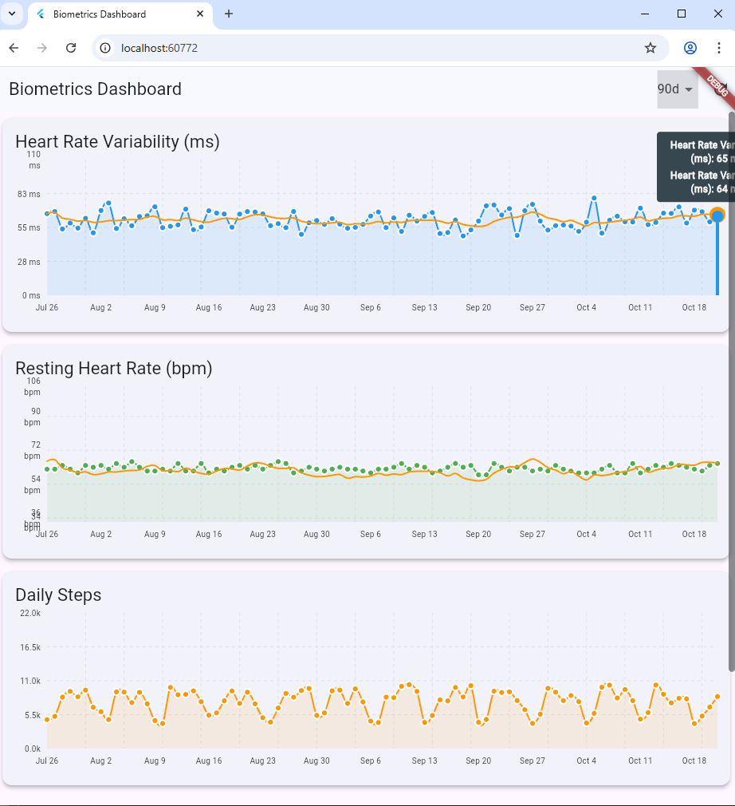
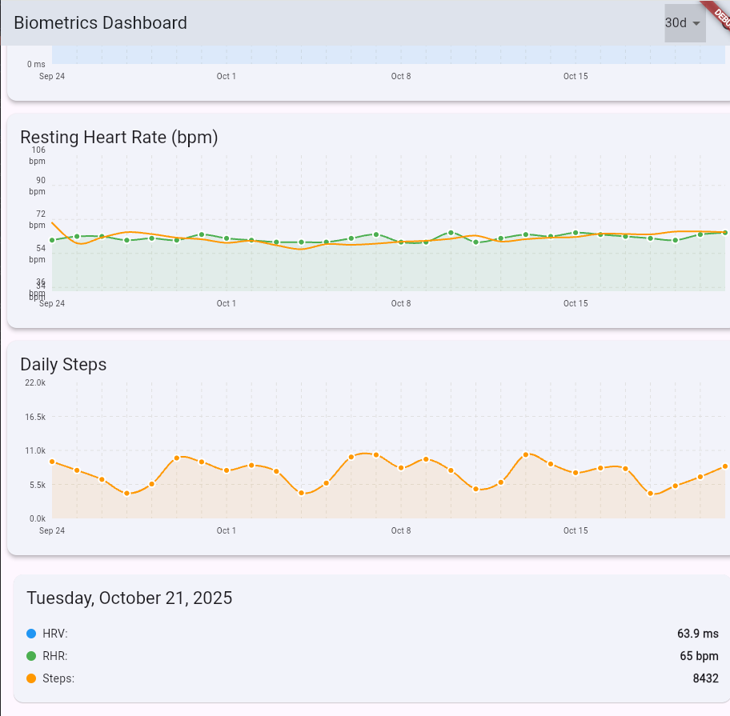

# Biometric Dashboard

A responsive Flutter web application for visualizing health metrics with interactive charts and real-time data synchronization.

## Features

- **Three Synchronized Charts**: HRV, RHR, and Steps visualization
- **Interactive UI**: Cross-chart tooltips and range selection
- **Responsive Design**: Works on desktop and mobile
- **Dark Mode**: Automatic theme switching
- **Data Simulation**: Realistic data loading with configurable latency

## Screenshots

<p align="center">
  
  <br>
  <em>Dashboard Overview</em>
</p>

<p align="center">
  
  
  <br>
  <em>Responsive Design (Desktop and Mobile)</em>
</p>

## Tech Stack

- **Framework**: Flutter Web
- **Charts**: fl_chart
- **State Management**: Provider
- **Data Handling**: Custom decimation for large datasets

## Getting Started

1. **Prerequisites**
   - Flutter SDK (latest stable)
   - Chrome (for development)

2. **Installation**
   ```bash
   flutter pub get
   flutter run -d chrome
   ```

3. **Building for Production**
   ```bash
   flutter build web
   ```
   Output will be in `build/web/`

## Testing

Run tests with:
```bash
flutter test
```

## Performance Notes
- Implements custom decimation for smooth rendering of large datasets (10k+ points)
- Optimized for fast loading and smooth interactions
- Handles data gaps and missing values gracefully

## Architecture

The application follows a clean architecture pattern with:
- **Data Layer**: `BiometricService` for data simulation and processing
- **Business Logic**: `BiometricController` for state management
- **Presentation**: Widgets for UI components and charts

## License
MIT

---

> **Note**: For a detailed explanation of technical decisions and trade-offs, see [TRADEOFFS.md](TRADEOFFS.md)
